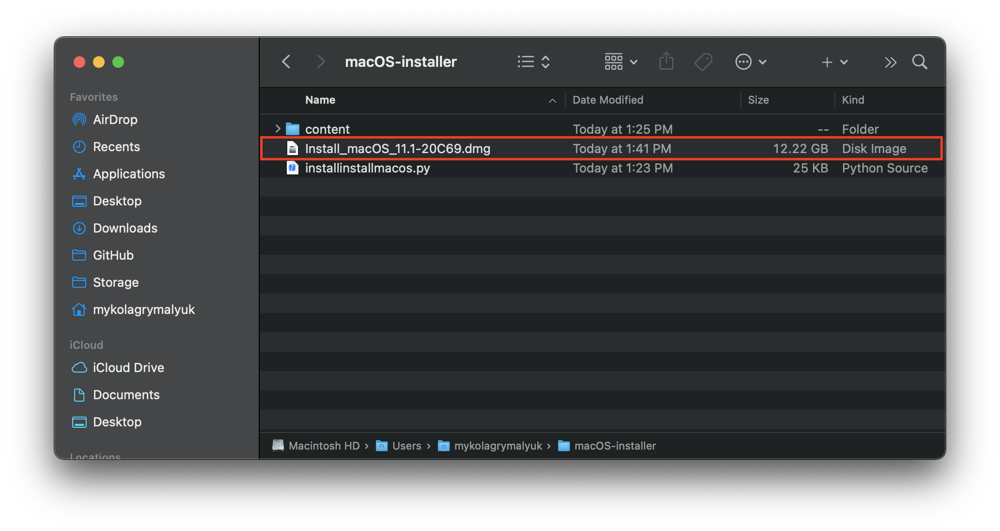
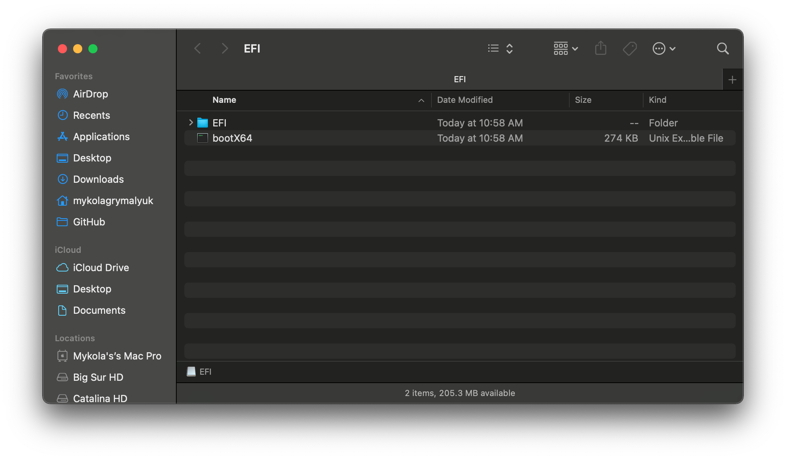

# Создание установщика в macOS

* Поддерживаемая версия: 0.6.6

В то время как вам не нужна чистая установка macOS чтобы использовать OpenCore, некоторые пользователи предпочитают иметь свежую версию ОС с обновлением их Boot Manager.

Для начала, мы захотим получить себе копию macOS. Вы можете пропустить этот шаг и перейти к форматированию USB, если вы просто делаете загрузочную флешку с OpenCore, а не установщик. Для всех остальных, вы можете загрузить macOS из App Store или с помощью скрипта от Munki.

## Скачивание macOS: современные версии

* Этот метод позволяет вам загрузить macOS 10.13 и новее, для 10.12 и старее, смотрите [Скачивание macOS: устаревшие версии](#скачивание-macos-устаревшие-версии)

С компьютера macOS, отвечающего требованиям версии ОС, которую вы хотите установить, перейдите в App Store и загрузите желаемый релиз ОС и продолжайте [**настройку установщика**](#настроика-установщика).

Для компьютеров, которым нужен конкретный релиз ОС или не удается загрузить из App Store, вы можете использовать утилиту InstallInstallMacOS от Munki.

Чтобы запустить его, просто скопируйте и вставьте следующую команду в терминал:

```sh
mkdir ~/macOS-installer && cd ~/macOS-installer && curl -O https://raw.githubusercontent.com/munki/macadmin-scripts/main/installinstallmacos.py && sudo python installinstallmacos.py
```


Как вы видите, мы получаем большой список установщиков macOS. Если вам нужна определенная версия macOS, вы можете выбрать её, набрав её номер. Для этого примера, мы выберим 10:


* **Примечание к macOS 11, Big Sur**: Так как эта ОС совершенна новая, есть некоторые проблемы с определенными системами, которые нужно решить. Для получения дополнительной информации, смотрите здесь: [OpenCore и macOS 11: Big Sur](../extras/big-sur/README.md)
  * Для начинающих пользователей, мы рекомендуем macOS 10.15, Catalina
* **Примечание к GPU Nvidia**: напоминание о том, чтобы проверить, поддерживает ли ваше оборудование новые ОС, смотрите [Аппаратные ограничения](../macos-limits.md)

Это займёт некоторое время, поскольку мы загружаем установщик macOS весом 8Гб+, поэтому мы настоятельно рекомендуем прочитать остальную часть руководства, пока вы ждёте.

По завершению, вы найдёте в папке `~/macOS-Installer/` файл DMG содержащий установщик macOS, и названный, например `Install_macOS_11.1-20C69.dmg`. Смонтируйте его и вы найдёте приложение-установщик.

* Примечание: Мы рекомендуем переместить приложение Установка macOS.app в папку `/Applications`, поскольку мы будем выполнять команды в этой директории.
* Примечание 2: Нажатие сочетания клавиш Cmd+Shift+G в Finder позволит вам легче перейти к папке `~/macOS-installer`




Начиная отсюда, перейдите к [Настройке установщика](#настроика-установщика) чтобы закончить свою работу.

## Скачивание macOS: устаревшие версии

* [Устаревшие версии macOS: автономный метод](./mac-install-pkg.md)
  * Поддерживаются 10.10-10.12
* [Устаревшие версии macOS: онлайн метод](./mac-install-recovery.md)
  * Поддерживаются 10.7-11
* [Устаревшие версии macOS: образы дисков](./mac-install-dmg.md)
  * Поддерживаются 10.4-10.6

## Настройка установщика

Теперь мы форматируем USB, чтобы подготовить его как к установщику macOS, так и к OpenCore. Мы хотим использовать macOS Extended (HFS+) с таблицей разделов GUID. Это создаст два раздела: основной `MyVolume` и второй под названием `EFI`, который используется как загрузочныйц раздел, где ваш firmware будет проверять загрузочные файлы.

* Примечание: По умолчанию, Дисковая Утилита показывает только разделы - нажмите Cmd/Win+2 , чтобы показать все накопители (или же можете нажать на кнопку Вид (View))
* Примечание 2: Пользователи следовавшие разделу "Устаревшая macOS: онлайн метод" могут перейти к [Настройке EFI окружения OpenCore](#настроика-efi-окружения-opencore)


Затем запустите команду `createinstallmedia` предоставленную [Apple](https://support.apple.com/ru-ru/HT201372). Обратите внимание на то, что эта команда используется для отформатированного USB с названием `MyVolume`:

```sh
sudo /Applications/Install\ macOS\ Big\ Sur.app/Contents/Resources/createinstallmedia --volume /Volumes/MyVolume
```

Это займёт некоторое время, так что вы можете взять чашечку кофе или продолжить читать руководство (честно говоря, вам не стоит следовать этому руководству шаг за шагом, не прочитав это всё сначала).

Также вы можете поменять путь `createinstallmedia` на тот, где находится ваш установщик (то же самое с названием накопителя)

::: details Устаревшие createinstallmedia команды

Взято с сайта Apple: [Создание загружаемого установщика для macOS](https://support.apple.com/ru-ru/HT201372)

```sh
# Big Sur
sudo /Applications/Install\ macOS\ Big\ Sur.app/Contents/Resources/createinstallmedia --volume /Volumes/MyVolume

# Catalina
sudo /Applications/Install\ macOS\ Catalina.app/Contents/Resources/createinstallmedia --volume /Volumes/MyVolume

# Mojave
sudo /Applications/Install\ macOS\ Mojave.app/Contents/Resources/createinstallmedia --volume /Volumes/MyVolume

# High Sierra
sudo /Applications/Install\ macOS\ High\ Sierra.app/Contents/Resources/createinstallmedia --volume /Volumes/MyVolume

# Sierra
sudo /Applications/Install\ macOS\ Sierra.app/Contents/Resources/createinstallmedia --volume /Volumes/MyVolume --applicationpath /Applications/Install\ macOS\ Sierra.app

# El Capitan
sudo /Applications/Install\ OS\ X\ El\ Capitan.app/Contents/Resources/createinstallmedia --volume /Volumes/MyVolume --applicationpath /Applications/Install\ OS\ X\ El\ Capitan.app

# Yosemite
sudo /Applications/Install\ OS\ X\ Yosemite.app/Contents/Resources/createinstallmedia --volume /Volumes/MyVolume --applicationpath /Applications/Install\ OS\ X\ Yosemite.app

# Mavericks
sudo /Applications/Install\ OS\ X\ Mavericks.app/Contents/Resources/createinstallmedia --volume /Volumes/MyVolume --applicationpath /Applications/Install\ OS\ X\ Mavericks.app --nointeraction
```

:::

## Настройка Legacy

Для систем, не поддерживающих UEFI загрузку, смотрите ниже:

::: details Настройка Legacy загрузки

Для начала, вам понадобится следующее:

* BootInstall_IA32.tool или BootInstall_X64.tool
  * Может быть найдено в OpenCorePkg по пути `/Utilties/LegacyBoot/`
* Установочная USB флешка(создана выше)  

В папке OpenCore, перейдите к `Utilities/LegacyBoot`. Здесь вы найдете файл названный `BootInstall_ARCH.tool`. Он устанавливает DuetPkg на нужный накопитель.


Теперь запустите эту утилиту в терминале **в sudo**(В противном случае, эта утилита, скорее всего, потерпит неудачу):

```sh
# Замените X64 на IA32, если у вас 32-битный процессор
sudo ~/Downloads/OpenCore/Utilities/legacyBoot/BootInstall_X64.tool
```


Это покажет вам список доступных дисков, выберите нужный, и вам будет предложено записать новый MBR. Выберите yes`[y]`, и на этом вы закончите.




Это даст вам EFI раздел с **bootia32** или **bootx64** файлом

:::

## Настройка EFI окружения OpenCore

Настроить EFI окружение OpenCore просто - всё что вам нужно сделать, это смонтировать наш системный EFI раздел. Это автоматически делается, когда мы форматируем в GUID, но по умолчанию размонтируется, так что появляется наш друг [MountEFI](https://github.com/corpnewt/MountEFI):


Вы заметите, что как только мы откроем EFI раздел - он будет пуст. Вот здесь и начинается самое интересное.


## Теперь, когда это всё сделано, перейдите к [Настройке EFI](./opencore-efi.md), чтобы закончить работу
