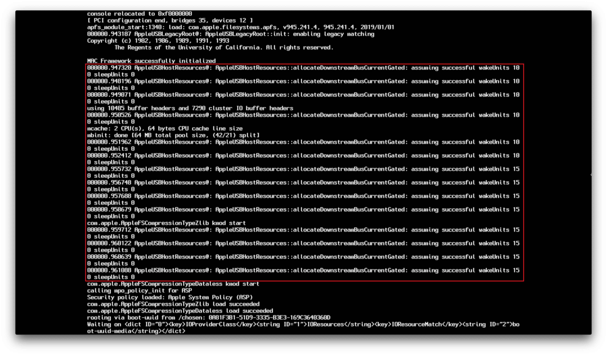
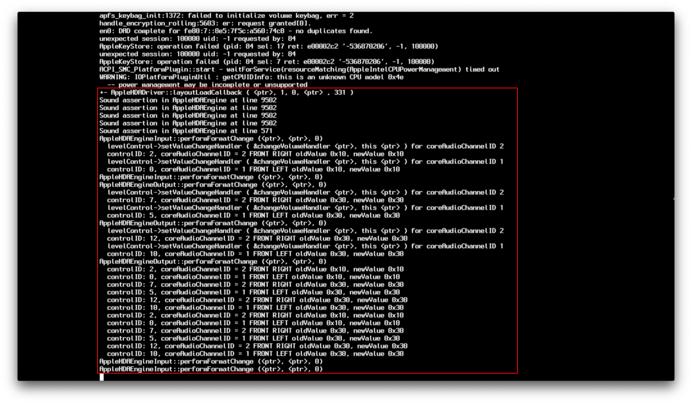
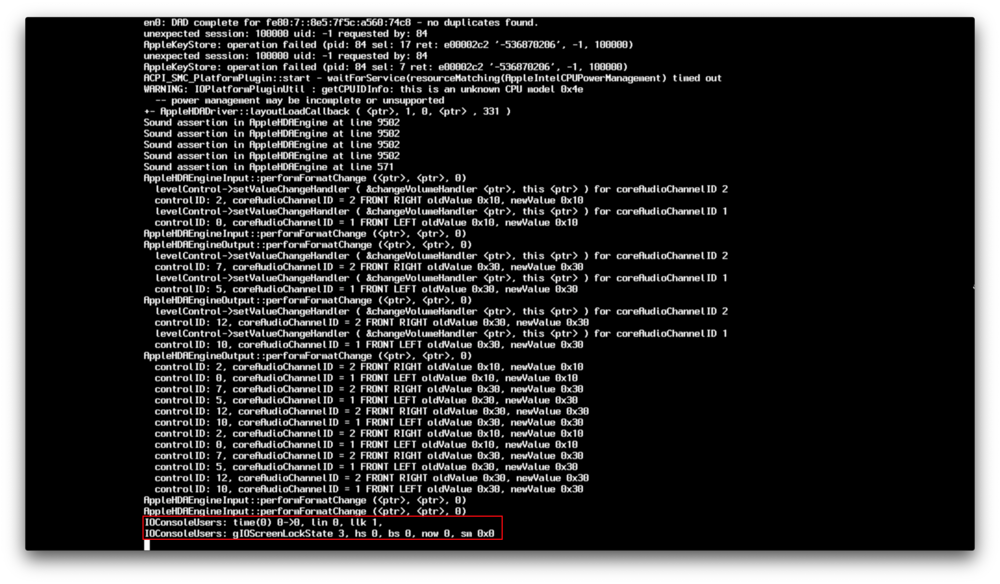

# Понимание процесса загрузки macOS

* Поддерживаемая версия: 0.6.7

Итак, при устранении неполадок в хакинтоше, может быть немного сложно понять, *где* вы именно застряли, поскольку точное ключевое слово по которому вы пытаетесь найти, может не совпадать с чем-либо в Google. Хотя эта страница не решит всех ваших проблем, по крайней мере, она должна помочь понять, где в процессе загрузки macOS вы застреваете, и надеемся, подскажет, по какой причине вы застряли.

## Загрузка OpenCore

Этот раздел будет кратким, так как проблемы с загрузкой OpenCore довольно редки и обычно являются простой ошибкой пользователя:

* Включение системы и поиск загрузочных устройств
* Система находит BOOTx64.efi на вашем USB-накопителе с OpenCore в EFI/BOOT/
* Загружается BOOTx64.efi, который потом по цепочке загружает OpenCore.efi из EFI/OC/
* Применяются свойства NVRAM
* EFI драйверы загружаются из EFI/OC/Drivers
* Устанавливается Graphics Output Protocol(GOP)
* Загружаются ACPI таблицы из EFI/OC/ACPI
* Применяются данные SMBIOS
* OpenCore загружает и показывает вам все возможные варианты загрузки
* Теперь вы загружаетесь в установщик macOS

Если на этом этапе у вас возникли проблемы с загрузкой, главное, что нужно проверить:

* [Зависает на `no vault provided!`](./extended/opencore-issues.md#зависает-на-no-vault-provided)
* [Не отображаются разделы с macOS](./extended/opencore-issues.md#не-отображаются-разделы-с-macos)
* [При загрузке OpenCore - происходит перезагрузка в BIOS](./extended/opencore-issues.md#при-загрузке-opencore-происходит-перезагрузка-в-bios)

Об остальных возможных проблемах, смотрите здесь:

* [Проблемы с загрузкой OpenCore](./extended/opencore-issues.md)

## boot.efi Handoff


Здесь выходит на сцену загрузчик macOS(boot.efi), в частности, то, что он делает - подготавливает среду для загрузки ядра, где OpenCore и инжектирует кексты. Если вы застряли на этом этапе, скорее всего, проблема с загрузкой ядра. Основные виновники:

* [Зависает на EndRandomSeed](./extended/kernel-issues.md#зависает-на-endrandomseed)
* [Зависает на `[EB|#LOG:EXITBS:START]`](./extended/kernel-issues.md#зависает-на-eb-log-exitbs-start)
* [Ошибки `Couldn't allocate runtime area`](./extended/kernel-issues.md#ошибки-couldn-t-allocate-runtime-area)

Об остальных возможных проблемах, смотрите здесь:

* [Проблемы с ядром](./extended/kernel-issues.md)

**Примечание**: В macOS 10.15.4, Apple изменила протокол отладки boot.efi, поэтому всё будет выглядеть несколько иначе, чем раньше, но все те же правила по-прежнему применяются

## XNU/Kernel Handoff

Теперь, когда boot.efi всё настроил для нас, мы можем понаблюдать, как ядро делает свое дело. Этот раздел обычно называют [Этапом укоренения (Rooting phase)](https://developer.apple.com/library/archive/documentation/Darwin/Conceptual/KernelProgramming/booting/booting.html):


В этом разделе проверяются данные SMBIOS, загружаются ACPI таблицы/Кексты, и macOS пытается привести всё в порядок. Обычно ошибки возникают в результате:

* Поврежденные SSDT
* Поврежденные кексты(или неправильно настроенные в вашем config.plist -> Kernel -> Add)
* Испорченная Memory Map

Подробнее об устранении неполадок см. здесь:

* [Паника ядра на `Cannot perform kext summary`](./extended/kernel-issues.md#паника-ядра-на-cannot-perform-kext-summary)
* [Паника ядра на `Invalid frame pointer`](./extended/kernel-issues.md#паника-ядра-на-invalid-frame-pointer)


Здесь теперь у нас `[ PCI configurations begin ]` (прим. пер. - Начало конфигурации PCI), этот раздел можно рассматривать как тест аппаратной части наших систем, кекстов и SSDT, которые мы инжектировали, и где IOKit запускает аппаратные пробы для поиска устройств для подключения.

Основное, что здесь проверяется:

* Встроенные контроллеры (EC)
* Хранилище(NVMe, SATA, т.д.)
* PCI/e
* NVRAM
* RTC
* PS2 и I2C

Более подробную информацию о том, как обойти эту область, смотрите здесь:

* [Зависает на `RTC...`, `PCI Configuration Begins`, `Previous Shutdown...`, `HPET`, `HID: Legacy...`](./extended/kernel-issues.md#зависает-на-rtc-pci-configuration-begins-previous-shutdown-hpet-hid-legacy)



Здесь вступает в игру ограничение в 15 портов и USB Mapping, а также появляются печально известные ошибки "Waiting for Root Device". Основные вещи, которые необходимо проверить:

* ["Waiting for Root Device" или ошибка запрещающего знака](./extended/kernel-issues.md#waiting-for-root-device-или-ошибка-запрещающего-знака)


А здесь выходят на сцену наши FakeSMC/VirtualSMC и творят свои чудеса, сам по себе DSMOS это кекст, который проверяет, есть ли в вашей системе SMC и запрашивает ключ. Если этот ключ отсутствует, DSMOS не расшифрует остальные бинарные файлы, и вы застрянете здесь. Также вы можете застрять на AppleACPICPU, что является точно такой же ошибкой.

* [kextd stall[0]: AppleACPICPU](./extended/kernel-issues.md#kextd-stall-0-appleacpicpu)

```
Your karma check for today:
There once was a user that whined
his existing OS was so blind,
he'd do better to pirate an OS that ran great
but found his hardware declined.
Please don't steal Mac OS!
Really, that's way uncool.
(C) Apple Computer, Inc.
```

Источник: Dont Steal Mac OS X.kext



А вот тут и вступает аудиодрайвер Apple, и здесь AppleALC сияет. Обычно здесь редко можно увидеть проблемы, но если вы их увидете, попробуйте отключить AppleALC и любые другие кексты, связанные со звуком.



И здесь мы подбираемся к инциализации драйвера графического процессора, и где WhateverGreen тоже творит свою магию. Обычно, ошибки здесь связаны с графическим процессором, а не с самим WhateverGreen. Основные виновники:

* [Зависает на или рядом с `IOConsoleUsers: gIOScreenLock...`](./extended/kernel-issues.md#зависает-на-или-рядом-с-ioconsoleusers-gioscreenlock-giolockstate-3)
* [Черный экран после `IOConsoleUsers: gIOScreenLock...` на Navi](./extended/kernel-issues.md#black-screen-after-ioconsoleusers-gioscreenlock-on-navi)

## macOS Handoff


И наконец-то вы преодолели всю эту многословность! Если вы застряли на логотипе Apple после Verbose, то есть пара вещей, которые нужно проверить:

* [macOS зависает перед входом в систему](./extended/kernel-issues.md#macos-зависает-перед-входом-в-систему)
* [Черный экран после `IOConsoleUsers: gIOScreenLock...` на Navi](./extended/kernel-issues.md#черныи-экран-после-ioconsoleusers-gioscreenlock-на-navi)
* [Зависает в установщике macOS после 30 секунд](./extended/userspace-issues.md#зависает-в-установщике-macos-по-прошествию-30-секунд)
