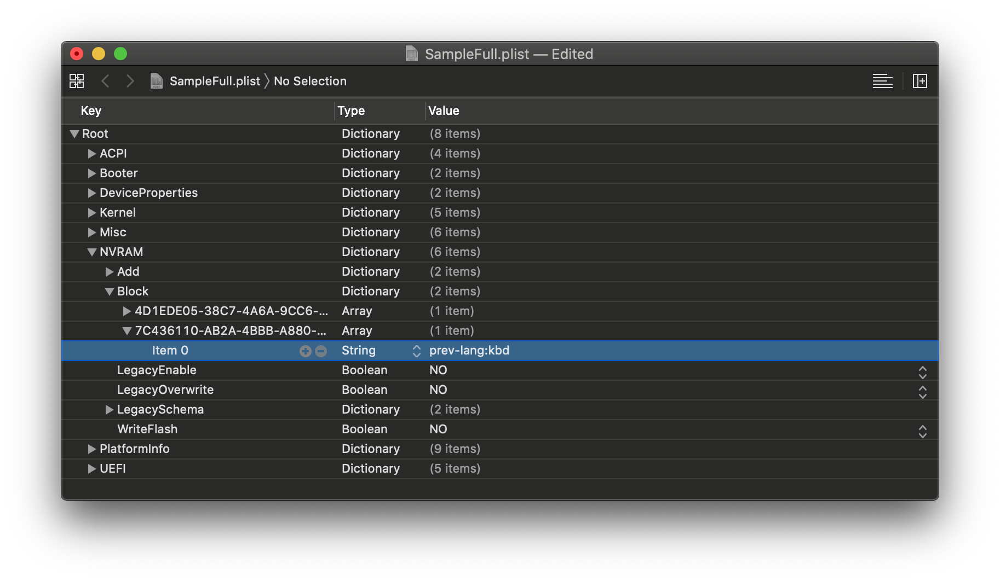
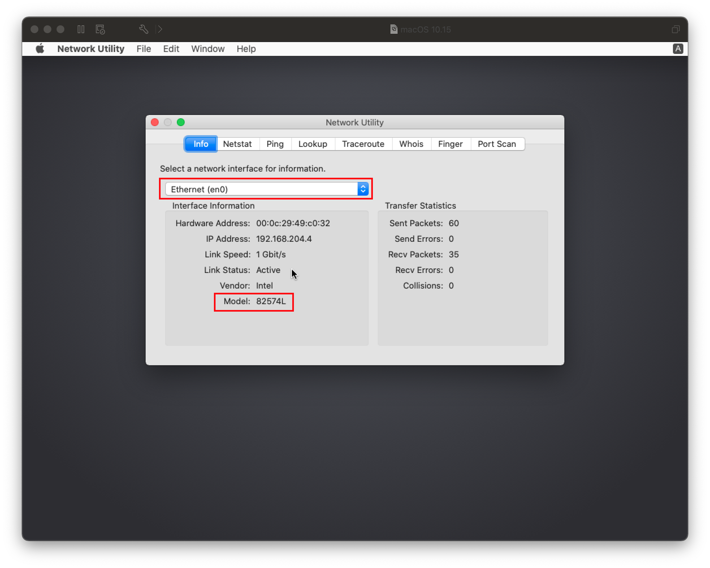
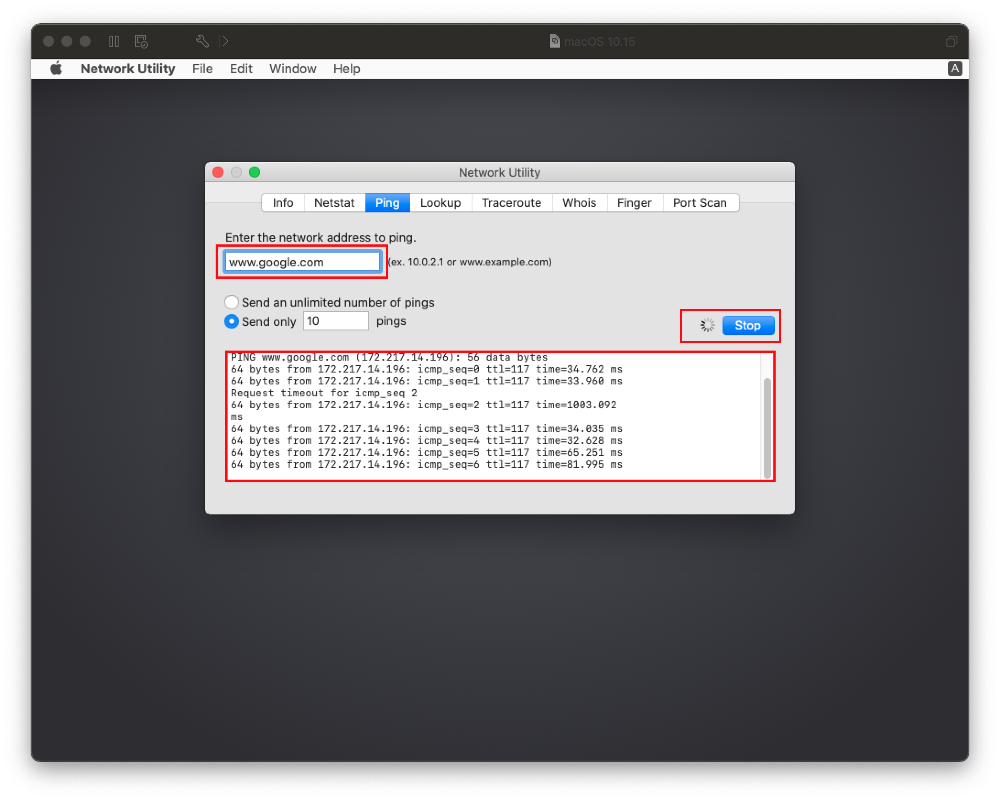

# Проблемы с Userspace

* Поддерживаемая версия: 0.6.6

Проблемы, связанные с тем, как только вы загрузили установщик и графический интерфейс.

* [Установщик macOS на русском](#установщик-macos-на-русском)
* [Установщик macOS поврежден](#установщик-macos-поврежден)
* [Зависает на или рядом с `IOConsoleUsers: gIOScreenLock...`](#зависает-на-или-рядом-с-ioconsoleusers-gioscreenlock-giolockstate-3)
* [Скремблированный экран на ноутбуках](#скремблированныи-экран-на-ноутбуках)
* [Черный экран после `IOConsoleUsers: gIOScreenLock...` на Navi](#черныи-экран-после-ioconsoleusers-gioscreenlock-на-navi)
* [Зависает в установщике macOS по прошествию 30 секунд](#зависает-в-установщике-macos-по-прошествию-30-секунд)
* [Перезагрузка на Buldozer или Jaguar после экрана «Данные и Конфиденциальность» (Data & Privacy)](#перезагрузка-на-buldozer-или-jaguar-после-экрана-«данные-и-конфиденциальность»-data-privacy)
* [macOS зависает прямо перед входом](#macos-зависает-прямо-перед-входом)
* [MediaKit сообщает, что на устройстве недостаточно свободного пространства](#mediakit-сообщает-что-на-устроистве-недостаточно-свободного-пространства)
* [Дисковой утилите не удалось выполнить стирание](#дисковои-утилите-не-удалось-выполнить-стирание)
* [SATA диски не отображаются в Дисковой утилите](#sata-диски-не-отображаются-в-дисковои-утилите)
* [Зависает на «Осталось 2 минуты»](#зависает-на-осталось-2-минуты)
* [Ошибка: The recovery server cannot get contacted](#ошибка-the-recovery-server-cannot-get-contacted)
* [Клавиатура и мышь не работают в Big Sur](#клавиатура-и-мышь-не-работают-в-big-sur)
* [Зависает на `Your Mac needs a firmware update in order to install to this volume`](#зависает-на-your-mac-needs-a-firmware-update-in-order-to-install-to-this-volume)

## Установщик macOS на русском

По умолчанию, sample.config на русском, потому что славяне правят миром Хакинтоша, проверьте значение `prev-lang:kbd` в разделе `NVRAM -> Add -> 7C436110-AB2A-4BBB-A880-FE41995C9F82`. Установите в `656e2d55533a30` для American: en-US:0, полный список может быть найден в [AppleKeyboardLayouts.txt](https://github.com/acidanthera/OpenCorePkg/blob/master/Utilities/AppleKeyboardLayouts/AppleKeyboardLayouts.txt). Для тех, кто использует простой текстовый редактор(например, UEFI Shell, Notepad++, т.д.), `656e2d55533a30` станет `ZW4tVVM6MA==`

Вам может также потребоваться сбросить NVRAM в меню выбора

* Примечание: Ноутбуки Thinkpad известны «окирпичиванием» после сброса NVRAM в OpenCore, мы рекомендуем сбрасывать NVRAM на этих компьютерах путем обновления BIOS.

Всё ещё не работает? Хорошее время для больших пушек. Мы принудительно удалим это свойство и позволим OpenCore восстановить его:

`NVRAM -> Delete -> 7C436110-AB2A-4BBB-A880-FE41995C9F82 -> Item 0`, установите Type `String` и Value `prev-lang:kbd`



## Установщик macOS поврежден

Если вы загрузили macOS до октября 2019 года, у вас, скорее всего, истек срок действия сертификата установщика macOS, есть 2 способа исправить это:

* Загрузить новейшую копию macOS
* Изменить дату в терминале на ту, когда сертификат был действительным

Напоследок:

* Отключите все сетевые устройства(Ethernet, отключите WiFi)
* В терминале рекавери установите на 1 сентября 2019 г.:

```
date 0901000019
```

## Зависает на или рядом с `IOConsoleUsers: gIOScreenLock...`/`gIOLockState (3...`

Это происходит прямо перед правильной инциализацией графического процессора, проверьте следующее:

* GPU поддерживает UEFI(GTX 7XX/2013+)
* CSM выключен в BIOS
* Форсированная пропускная способность [на уровне] PCIe 3.0
* Дважды проверьте, что значения ig-platform-id и device-id правильные, если запускается на iGPU.
  * Настольные UHD 630 могут нуждаться в использовании `00009B3E`
* Попробуйте различные [«фиксы» WhateverGreen](https://github.com/acidanthera/WhateverGreen/blob/master/Manual/FAQ.IntelHD.en.md) ([на русском](https://www.applelife.ru/threads/intel-hd-graphics-3000-4000-4400-4600-5000-5500-5600-520-530-630.1289648/))
  * Загрузочный аргумент `-igfxmlr`. Это также может проявляться как ошибка «Деления на ноль» (Divide by Zero).
* Пользователям Coffee Lake iGPU также может потребоваться `igfxonln=1` в 10.15.4 и новее

## Скремблированный экран на ноутбуках

* Примечание от переводчика: Скремблированный экран (англ. - Scrambled Screen) - экран, у которого вместо изображения помехи.

Включите CSM в настройках UEFI. Это может выглядить как "Boot legacy ROMs" или другие legacy настройки.

## Черный экран после `IOConsoleUsers: gIOScreenLock...` на Navi

* Добавьте `agdpmod=pikera` в аргументы загрузки
* Переключитесь между различными выходами дисплея
* Попробуйте запустить SMBIOS MacPro7,1 с boot-arg `agdpmod=ignore`

Для пользователей MSI Navi, вам необходимо применить патч упомянутый здесь: [Installer not working with 5700XT #901](https://github.com/acidanthera/bugtracker/issues/901)

В частности, добавьте следующую запись в `Kernel -> Patch`:

```
Base:
Comment: Navi VBIOS Bug Patch
Count: 1
Enabled: YES
Find: 4154592C526F6D2300
Identifier: com.apple.kext.AMDRadeonX6000Framebuffer
Limit: 0
Mask:
MinKernel:
MaxKernel:
Replace: 414D442C526F6D2300
ReplaceMask:
Skip: 0
```

## Зависает в установщике macOS по прошествию 30 секунд

Это, вероятно, связано с ошибкой или полным отсутствием NullCPUPowerManagement, тот, который размещен на AMD OSX Vanilla Guide, поврежден. Чтобы решить эту проблему, удалите NullCPUPowerManagement из `Kernel -> Add` и `EFI/OC/Kexts`, затем включите `DummyPowerManagement` в разделе `Kernel -> Emulate`

## Перезагрузка на Buldozer или Jaguar после экрана «Данные и Конфиденциальность» (Data & Privacy)

Следуйте инструкциям здесь после UPDATE 2: [Fix Data and Privacy reboot (на английском)](https://www.insanelymac.com/forum/topic/335877-amd-mojave-kernel-development-and-testing/?do=findComment&comment=2658085)

## macOS зависает прямо перед входом

Это типичный пример «пьяного» TSC, для большинства систем добавляется [CpuTscSync](https://github.com/lvs1974/CpuTscSync)

Для Skylake-X, многие прошивки, включая Asus и EVGA, не будут записывать данные во все ядра. Поэтому нам необходимо сбросить TSC при холодной загрузке и проснуться с помощью [TSCAdjustReset](https://github.com/interferenc/TSCAdjustReset). Скомпилированную версию можно найти здесь: [TSCAdjustReset.kext](https://github.com/dortania/OpenCore-Install-Guide/blob/master/extra-files/TSCAdjustReset.kext.zip). Обратите внимание, что вы **должны** открыть кекст (Показать содержимое пакета в Finder, `Contents -> Info.plist`) и изменить в Info.plist -> `IOKitPersonalities -> IOPropertyMatch -> IOCPUNumber` на ваше количество потоков процессора, начиная отсчёт с `0` (У 18-ядерного i9 7980xe будет `35`, поскольку всего у него 36 потоков)

Самый распространенный способ увидеть проблему с TSC:

Случай 1    |  Случай 2
:-------------------------:|:-------------------------:
  |  

## MediaKit сообщает, что на устройстве недостаточно свободного пространства

Эта ошибка возникает из-за небольшого размера EFI, по умолчанию, Windows создает EFI размером 100 МБ, тогда как macOS ожидает 200 МБ. Чтобы обойти это, у вас есть 2 пути:

* Расширить EFI раздел до 200 МБ(см. в Google, как это сделать)
* Отформатировать весь диск, а не один раздел
  * Обратите внимание, что по умолчанию, Дисковая утилита показывает только разделы, нажмите Cmd/Win+2 для отображения всех устройств(в качестве альтернативы, вы можете нажать кнопку «Вид» (View))

По умолчанию           |  Показывать все устройства(Cmd+2)
:-------------------------:|:-------------------------:
  |  

## Дисковой утилите не удалось выполнить стирание

Здесь 1(или больше) из 5 проблем:

* Форматирование раздела, а не диска, см. [раздел выше](#mediakit-reports-not-enough-space)
* У Дисковой утилиты есть странный баг, когда он не может стереть в первый раз, попробуйте выполнить стирание ещё раз
* Поддержка SATA Hot-plug в BIOS вызывает проблемы(попробуйте отключить эту опцию)
* Старая прошивка, убедитесь, что на накопителе установлена последняя прошивка
* И, напоследок, у вас может быть просто битый диск

## SATA диски не отображаются в Дисковой утилите

* Убедитесь, что AHCI включен в BIOS
* Некоторые SATA-контроллеры могут официально не поддерживатся macOS, в этих случаях, вам понадобится [CtlnaAHCIPort.kext](https://github.com/dortania/OpenCore-Install-Guide/blob/master/extra-files/CtlnaAHCIPort.kext.zip)
  * Для очень устаревших SATA-контроллеров, [AHCIPortInjector.kext](https://www.insanelymac.com/forum/files/file/436-ahciportinjectorkext/) может быть более подходящим.

## Зависает на Осталось 2 минуты


Эта ошибка напрямую связана с этапом, на котором macOS будет записывать переменные в NVRAM для следующей загрузки вашей системы, поэтому, когда возникают проблемы с NVRAM, система будет зависать здесь.

Чтобы решить эту проблему, у нас есть несколько вариантов:

* «Фикс» для 300-ой серии Intel(например, Z390):
  * [SSDT-PMC](https://dortania.github.io/Getting-Started-With-ACPI/)
* Остальные могут установить в своем config.plist следующее:
  * LegacyEnable -> YES
  * LegacyOverwrite -> YES
  * WriteFlash -> YES

## Ошибка: The recovery server cannot get contacted

Если вы сделали установщик в Windows или Linux, это означает то, что ваш USB-установщик на основе рекавери. А это в свою очередь означает то, что на USB-накопителе только лишь небольшая часть установщика macOS, а остальная часть должна быть загружена с серверов Apple в USB-установщике. И причина, по которой мы не включаем руководства по созданию полных установщиков, связана с нестабильными HFS драйверами и другими утилитами, которые обычно приводят к повреждению данных.

Чтобы эту устранить ошибку, у вас есть несколько вариантов:

* Убедитесь, что у вас есть рабочее соединение Ethernet или WiFi
  * Откройте `Сетевая утилита` в меню `Утилиты` в установщике и посмотрите, отображается ли ваша сетевая карта
    * Если ваша сетевая карта **не отображается**, то, скорее всего, у вас отсутствует кекст на сеть
      * См. здесь: [Кексты на Ethernet](../../ktext.md#ethernet) и [Определение вашего оборудования](../../find-hardware.md)
    * Если сетевая карта **отображается**, запустите `ping -c3 www.google.com` в терминале установщика, чтобы убедиться, что ваше сетевое соединение рабочее
      * Если ничего не отображается, либо ваша сеть, либо кексты неправильно работают
        * Мы рекомендуем попробовать старые версии кекстов, в случаях, когда в новых сборках есть странные баги с вашим оборудованием
      * Если он что-то возвращает, то проблема на стороне Apple. К сожалению, вам просто нужно будет попробовать в другой раз

| Проверка сетевой карты | Ping |
| :--- | :--- |
|  |  |

## Клавиатура и мышь не работают в Big Sur

Для некоторых устаревших систем(например, Core2 Duo/2010 и старее), вы можете заметить, что когда USB-порты работают, ваши HID-устройства, такие как клавиатура и мышь, могут быть сломаны. Чтобы решить эту проблему, добавьте следующий патч:

::: details Патч IOHIDFamily

config.plist -> Kernel -> Patch:

| Key | Type | Value |
| :--- | :--- | :--- |
| Base | String | _isSingleUser |
| Count | Integer | 1 |
| Enabled | Boolean | True |
| Find | Data | |
| Identifier | String | com.apple.iokit.IOHIDFamily |
| Limit | Integer | 0 |
| Mask | Data | |
| MaxKernel | String | |
| MinKernel | String | 20.0.0 |
| Replace | Data | B801000000C3 |
| ReplaceMask | Data | |
| Skip | Integer | 0 |

[Источник](https://applelife.ru/threads/ustanovka-macos-big-sur-11-0-beta-na-intel-pc-old.2944999/page-81#post-884400)

:::

## Зависает на `Your Mac needs a firmware update in order to install to this volume`

Если вам будет предложено обновить прошивку для установки на APFS том, то это, скорее всего, указывает на устаревшую SMBIOS таблицу. Сначала проверьте следующее:

* У вас включен `PlatformInfo -> Automatic`
* `UpdateSMBIOSMode` установлен в `Create`
  * Для компьютеров Dell и VAIO убедитесь, что `CustomSMBIOSGuid` включен и `UpdateSMBIOSMode` установите в `Custom`
* Вы используете SMBIOS, поддерживаемый этой версией macOS
  * т.е. вы не используете `-no_compat_check`
* Вы используете последнюю версию OpenCore

Если вы все еще получаете эту ошибку, вероятно, в самом OpenCore есть какая-то устаревшая информация о SMBIOS. Мы рекомендуем перейти на аналогичный SMBIOS и посмотреть, будет ли это решено. Полный список SMBIOS см. здесь: [Выбор правильного SMBIOS](../../extras/smbios-support.html)
